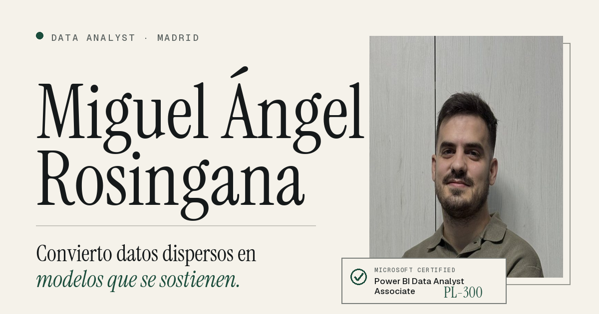

# Portfolio · Miguel Ángel Rosingana

Portfolio personal de **Data Analyst**. HTML, CSS y JavaScript sin frameworks
ni proceso de build.

**→ [miguelangelrosingana.github.io/portfolio](https://miguelangelrosingana.github.io/portfolio/)**



---

## Qué hay dentro

Hero con la credencial Microsoft PL-300, la historia de cómo llegué a los
datos desde el desarrollo web, cómo trabajo (modelado, automatización,
comunicación), una trayectoria dividida en **Experiencia** y **Formación**, y
tres proyectos contados en formato **Problema / Enfoque / Resultado** —un
modelo financiero en Power BI sobre un esquema en estrella, el seguimiento de
una temporada del FC Barcelona a nivel de evento, y EcoChef, mi TFG en
Flask— cada uno con un visor de capturas por pestañas.

## Decisiones técnicas

- **Sin dependencias.** Ni framework, ni bundler, ni gestor de paquetes.
  Vanilla JS con patrón IIFE; funciona igual en `file://`, GitHub Pages o
  cualquier hosting estático.
- **Bilingüe ES/EN sin duplicar páginas.** El español vive directamente en el
  HTML; `lib/manifest.js` trae el diccionario en inglés y `main.js` lo
  intercambia con un botón, guardando la preferencia.
- **Tema claro y oscuro.** Paleta en variables CSS (`:root` / `[data-theme]`),
  con transición circular al cambiar.
- **Contenido primero.** El HTML lleva todo el texto e imágenes; el JS solo
  anima, revela al hacer scroll y monta el visor de capturas. Con JavaScript
  desactivado se sigue viendo todo.
- **Responsive real.** Composición propia en móvil, sin scroll horizontal en
  ningún ancho, y accesible (foco visible, `alt` en toda imagen,
  `prefers-reduced-motion` respetado en las animaciones intrusivas).

## Stack

`HTML` · `CSS` (grid, variables, `clamp()`, `color-mix`) · `JavaScript`
(vanilla) · `GitHub Pages`

## Estructura

```
├── index.html            Marcado completo: contenido en español + estructura
├── styles.css            Estilos, en secciones
├── main.js               Punto de entrada (IIFE): i18n, tema, reveals, visor
├── lib/manifest.js        Datos + diccionario en inglés (window.__BRAND__)
├── favicon.svg
└── assets/
    ├── img/*.webp         Foto y capturas de los informes
    ├── og.png             Tarjeta de previsualización al compartir el enlace
    └── *.pdf              CV descargable
```

## Desarrollo

No hace falta build ni servidor para casi todo: abre `index.html` en el
navegador. Para depurar el visor de capturas o las transiciones, sirve la
carpeta con cualquier servidor estático (por ejemplo `python -m http.server`).

---

## English

Personal **Data Analyst** portfolio. Plain HTML, CSS and vanilla JavaScript,
no frameworks, no build step, served from GitHub Pages.

Bilingual (Spanish content in the HTML, English dictionary in
`lib/manifest.js`), light/dark theme via CSS variables, content-first markup
so the page works with JavaScript off, and a tabbed screenshot viewer for the
two Power BI projects. Three data projects, each told as Problem / Approach /
Result.

---

## Contacto

**Miguel Ángel Rosingana Martín** · Data Analyst · Madrid
[miguel.rosin@gmail.com](mailto:miguel.rosin@gmail.com) ·
[LinkedIn](https://www.linkedin.com/in/miguel-angel-rosingana)
